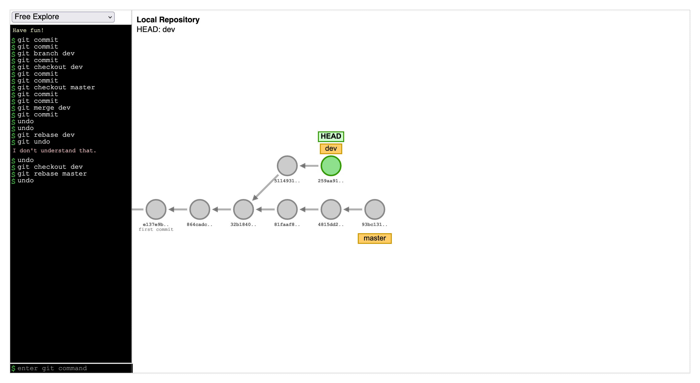
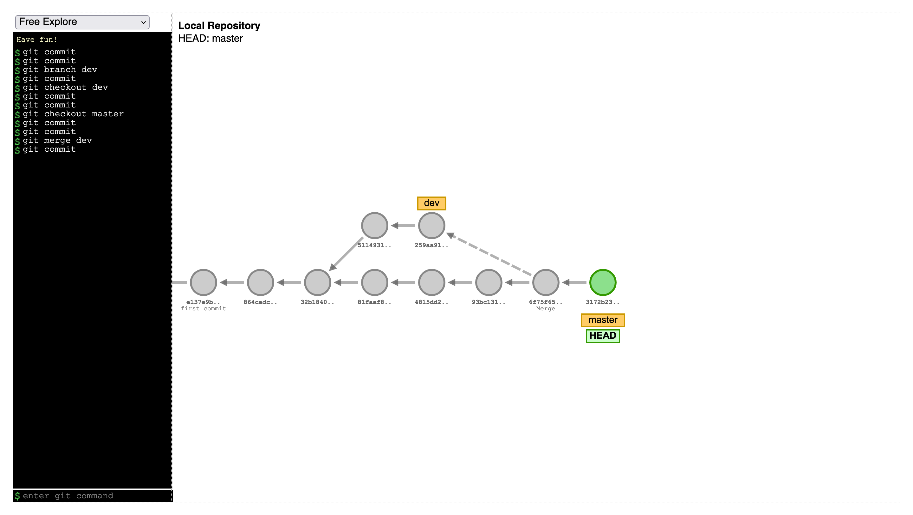
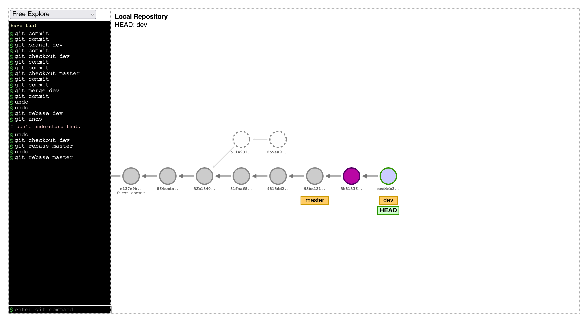
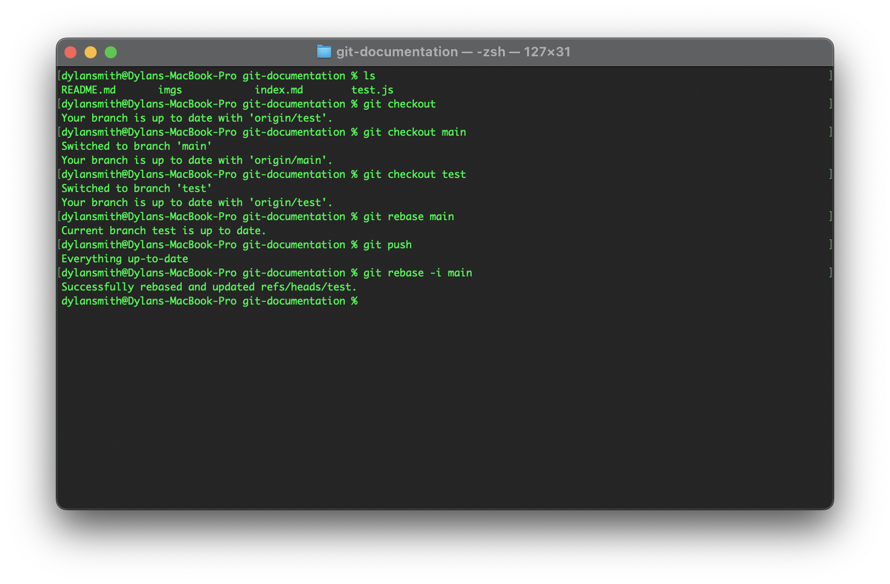
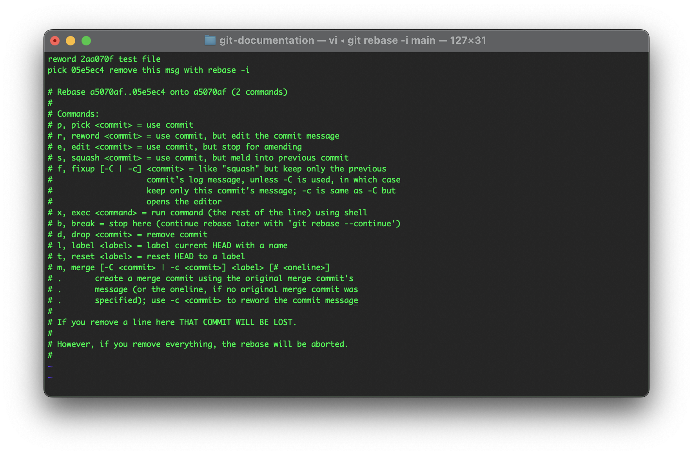
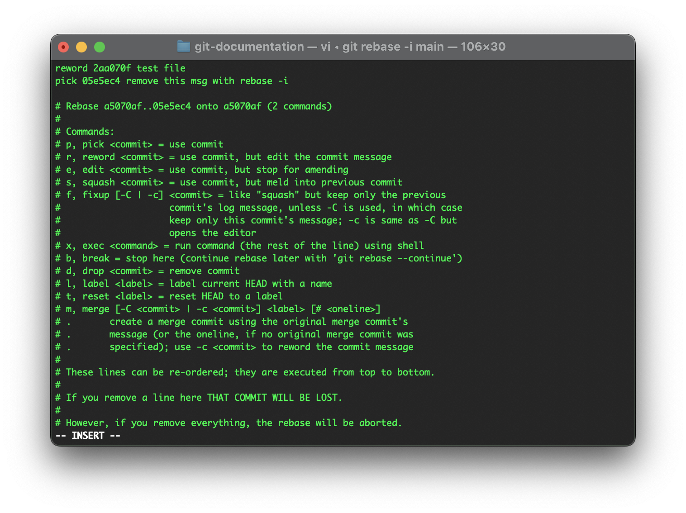
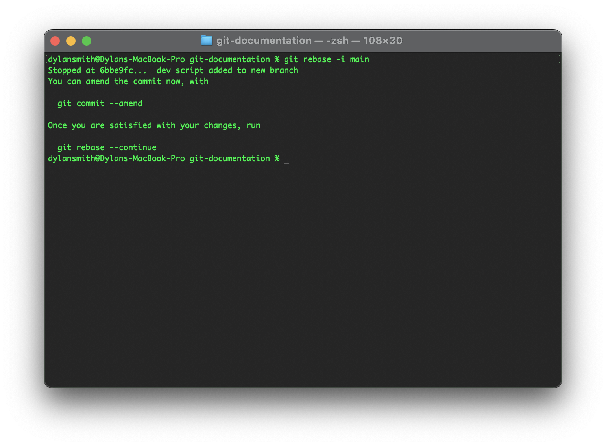
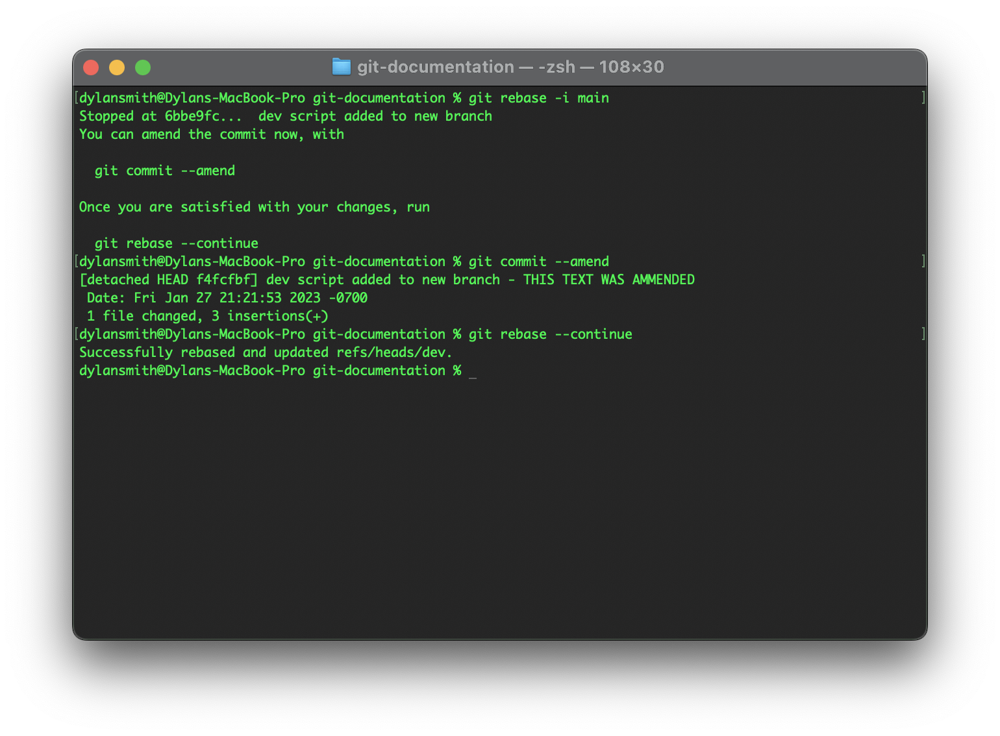
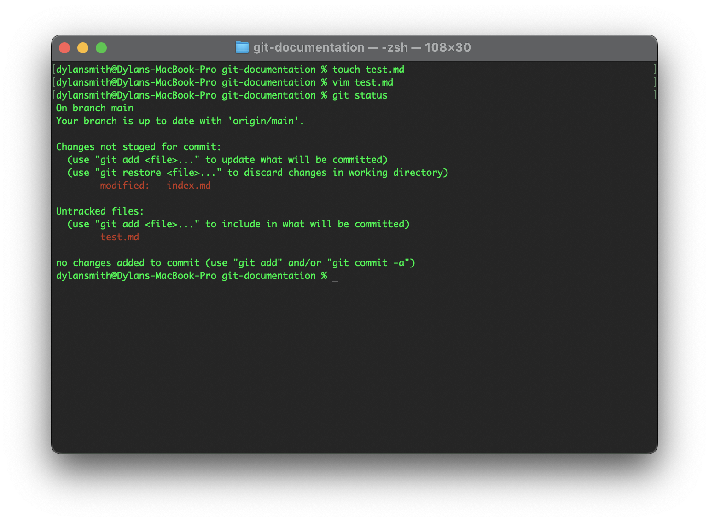
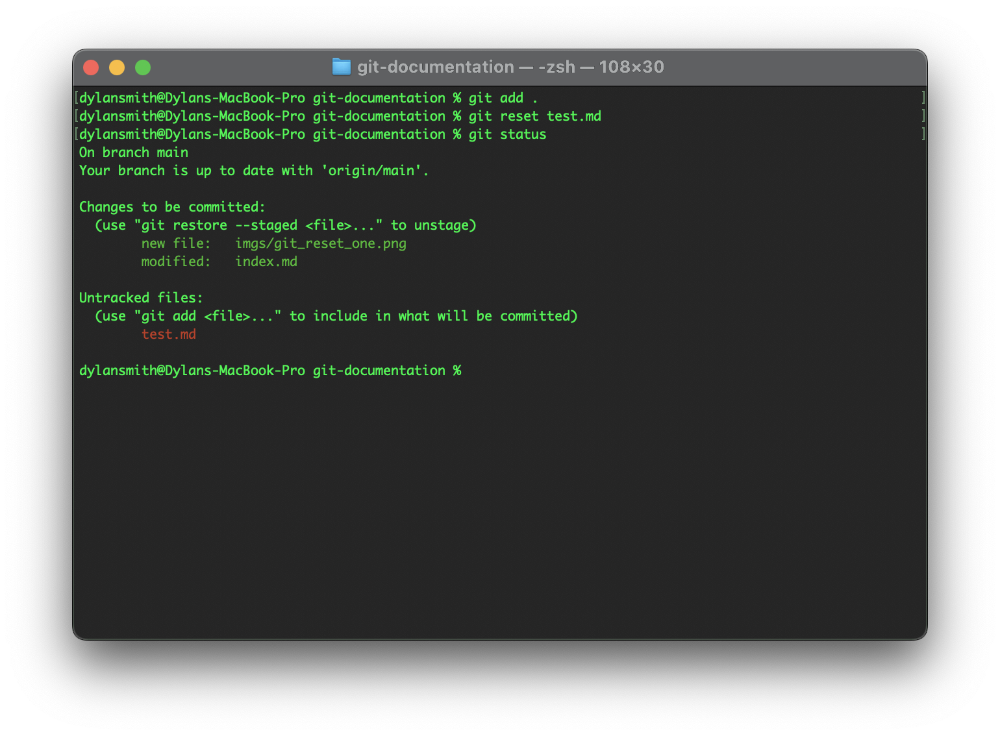

# Git Basics

## What is Git?

Git is a project management tool for the development of applications. The tool gained prominence in the industry for being an open-source version control system. With the capabilities to be distributed, meaning that this is a version control system that puts a copy of the repository (package of code) on a developer's computer. Enabling them to interact with that local copy by _branching_, _merging_, and _committing_ changes. Also giving a developer the ability to navigate between branches, commit history, and much more all in something called a _repository_. Which is essentially a Git initialized project that lets you have version control capabilities.

## Why use Git? What problem does it solve?

When working with projects in general, it would be wise to work on that project and produce multiple versions of that. So that the project iterates and grows to a final version (e.g., rough drafting up to a final version). Using Git can help establish a workflow that ensures the development of a project, with multiple iterations. The ability to travel back in _time_ of a git repository history is possible too since each commit is tracked in a timeline. It is also possible to traverse branches too, which can be different build versions of an application--production or development for example.

Having the ability to traverse a figurative tree, in other words, a _file tree structure_. Lets developers or teams manage each step of a project and go back to a commit in the repositories history. One major thing that Git helps solve is the ability to collaborate with others on a project. Working on a selected file could lead to conflicts of some kind. For example, for a project, there is a location designated for the files, and being able to work on the same file as another is not recommended or is impossible. You would have to coordinate with what files you would be working on and also figure out a way to have access to the source of the project. To solve this Git, lets developers install copies of the repository on their machine and then contribute to the projects through their commits.

## What is the difference between Git and Github?

Multiple services use the name **Git** within their branding. Such as `Github`, `GitLab`, and `GitBucket`. This is because Git is an open-source system that services have created hosting. The version control system itself could run independently of these services, although most are free to use. It's possible to house a repository locally on one machine, or a part of a local network/server. However, hosting a repository remotely is easy and it safeguards it from being accidentally deleted, meaning there is a backup in a safe location.

Github does not own the Git DVCS, since that is open source. What they do is build upon that service and make it visual and easy to use. When a repository is set up on GitHub, that is known as a _remote_. Meaning it is not locally present on the machine, but is remotely accessible. Typically, git remotes have been configured to be a URL. This is where GitHub comes to play, by integrating their service with Git. Any code commits on a working project, could be _pushed_ to the remote, updating the source of truth for an application.

 

# Git rebase

## What is Git rebase?

Git creates a trail that represents the history/timeline of a repository. But this timeline can get layered or start to look like a tree, these layers are branches. In the [Why use Git?](#why-use-git-what-problem-does-it-solve) section, git branches were mentioned as to how they can be used as production or dev branches.

We could merge those branches into one again. The history is preserved though, meaning that the branch and its commits still exist. But the code was merged into one project once again, updating the code and the project is continuing on one _main_ branch again. This is a common practice of managing branches and is notable on GitHub with how the community works on public repositories.

Instead, we could rebase the new branch into the main branch of the repository. What is different about merging here, is that the history of that branch is technically destroyed. Albeit, navigating to them via _checkout_ is still possible. But those commits in the "location" of the old branch are _orphaned_. The image example above demonstrates what is happening to the branch. The new branch's commits have been moved and their "past lives" have been more or less, deleted.

### `What are some advantages and disadvantages of Git rebase?`

**Advantages**:

- Commits and work is being saved and _moved_ to the main branch.
- Project and version history is being merged into one cohesive timeline.

**Disadvantages**:

- Branch history is destroyed and former commits are orphaned.
- Branch history is placed at closer to the _head_ of the main branch. Rewriting history in a way.

## When shouldn't you use Git rebase? Why?

This process is rewriting history and is destructive. It could be used productively probably, if and only the developers involved know what they are doing and have true sight of goals in mind. If there is teamwork involved and an extensive history of a project, you shouldn't be using git rebase. To keep the milestones in place, not only for reference and integrity of the repository. This could introduce conflicts and a loss of translation could happen in public repositories.

- ### Create a new repo and demonstrate your knowledge of the following items with screenshots:

  - A rebase merge
  - An interactive rebase merge

### When you shouldn't rebase with a remote repo.

If the master remote repository's commits are out of sync with the local repository, meaning the master was ahead of the local without the local _knowing_ about it. Especially if other developers are working on that remote branch. Pushing the code could delete commits and reformat the commit history, causing conflicts for developers looking at the code. This could also introduce merge conflicts that would need to be addressed because the branches are out of sync. Every developer contributing to the repository could be working on multiple branches and push commits. Once one developer releases, other developers don't see that and everyone's work starts to diverge.

# Git reset, checkout, and revert

## What is Git reset?

Each time there is an untracked file, git will prompt for that file to be staged and finally committed to the git repository's history. That's the version control system ensuring files are tracked and in a history/timeline. Once a commit has been made, that is more or less permanent--unless `git revert` is used. Before that commit event, files that have been staged have a _last chance_ to be _unstaged_ via the command `git reset <file>`. This is helpful because sometimes you may have to edit a file and/or a file was accidently staged. This could happen in the CLI by running the `git add .`, which is telling that all untracked files that have been changed are staged and ready for commit.

See below for an example of how to run the `git reset` command.

## What is the difference between hard, mixed and soft?

#### `--hard`

<video src="video/git_reset.mp4" autoplay loop muted></video>

The video example above demonstrates the `--hard` flag on a `git reset` command. This ultimately destroys the work that was staged completely. Use this if the file should be completely removed, avoid it if you want to rework a file but just upstage it. Git is resetting everything here, everything on the working tree is lost [Git](https://git-scm.com/docs/git-reset#Documentation/git-reset.txt-emgitresetemltmodegtltcommitgt)

### `--mixed`

<video src="video/git_reset_mixed.mp4" autoplay loop muted></video>

The video example is demonstrating the `git reset --mixed` command. This is resetting the working tree/directory and the staging area too. However, the file isn't lost and the content that was added to it is kept.

### `--soft`

Running this command doesn't interact with or edit the working tree and staging area. After staging a file and running this command, the commit is updated and ready to be committed differently if needed ([Stackoverflow](https://stackoverflow.com/questions/2530060/in-plain-english-what-does-git-reset-do)). Using this as opposed to the `--mixed` command makes more sense to me since it's possible to see exactly what is happening to the files. However, the `--soft` command is keeping everything left as is and leaves staged files to be ready for committing.

## What is Git checkout?

<video src="video/gitcheckout.mp4" autoplay loop muted></video>

Navigating the git history is possible via the `git checkout <commit/branch>` command. Having the ability to look back on the history of a repository is important. Looking back on past work is beneficial. However, navigating between branches or versions of a repository introduces the ability to work between _production_ and _dev_ branches. Or, any type of branch that is needed to test something or introduce a new feature. Typically, the branches would be merged to integrate the latest features of an application.

Running `git merge <branch>` will merge those branches back into one, but keeping the commit history intact. Keep in mind where the **HEAD** is located at all times by using the checkout command. Any actions like a commit when the **HEAD** isn't at the top level of a branch could result in an orphaned commit.

## What is Git revert?

<video src="video/git_revert.mp4" autoplay loop muted></video>

Reverting is the process of _going back_ or inversing something. With commits, these can be reverted to a previous state. This process isn't necessarily destructive. The commit history is preserved, meaning after a revert a commit that was _reverted_ could be navigated to still via the `checkout` command. But, the work that was committed is undone and the code in a file is reverted to a previous/original state, before the most recent commit.

The video above demonstrates what happens to a created `test.md` file with some string in it. The text will be modified by two different commits and reverted to the initial commit state. Because of the `git revert HEAD` command. Which is targeting the most recent commit/or where the HEAD is. Then reverting the code to the commit just before that.

## In what ways are these commands the same and what ways are they different?

Reset and Revert are similar in that they are commands that undo something in a sense. Each git command allows a developer to revert to a certain point of the git workflow, because of the version control system. Git Reset is managing the stage states of untracked files--before commits. Using the flags for `--hard`, `--mixed`, and `--soft` will manipulate how the Reset command updates the staging area.

Working with commits, Revert is used to back up the code to a certain point in time. While keeping the commit history preserved. If there was an error within the commit, such as a bug with some code. It is possible to revert to that commit before the bug was introduced. Working with commits makes Revert different to Reset.

## When would you use reset, checkout, or revert? Why?

Resets are going to typically happen during the staging area. Before any commits happen, something could go wrong that requires a file to be edited and re-staged. Using the `--mixed` flag will probably be the best thing to do since it's the safest way to keep a file that you don't want to be lost completely.

Checkouts should happen whenever you need to navigate a branch's commit history or between branches. Between branches may be the typical workflow seen, especially between a production or development build of apps. It's key to keep in mind though where the **HEAD** is and how merges would affect other branches.

Reverts should happen when an error with a commit happens. This could be a bug within the code that was over looked or a commit that was supposed to happen in general. This reverts the state of the commit history to the last commit, with the _older_ code. However, this keeps the git history intact and lets anyone know there was a revert that happened. It is nice to have a well-documented repository and commit history.

- ### Create a new repo and demonstrate your knowledge of the following items with screenshots:

  - a Git reset
  - a Git checkout
  - a commit
  - a Git revert

<video src="video/gitDemo.mp4" autoplay loop muted></video>

# Git submodules

## What are Git submodules?

Working with other repositories is possible via `git submodules`. When working on a project, there may be a feature or other application that has it's own tracked git repository. You can integrate that git repository with the working one. Via the command `git submodules add <repository>`. This seeds a reference to that git repository by a `.gitmodules` file and installs it locally as well.

Configuration should be implemented to improve the workflow when using submodules. But the general concept is, to have a working repository that needs a feature integrated. This feature is housed in another repository. Running `git submodule <repository>` will generate that file mentioned. Then giving the developer the to interact with that repository locally for another repository. Syncing though is a bit different, as compared to a `git pull`. To update a submodule in a direct way via the CLI is running `git submodule update --remote`. This fetches the remote repositories latest code for the submodule and updates it locally ([theserverside](https://www.theserverside.com/blog/Coffee-Talk-Java-News-Stories-and-Opinions/How-to-update-Git-submodules)).

## When would you use a submodule?

Using a submodule is going to be a very specific use case(s). Because typically, using `npm` is going to be better when trying to work with external code. It is also a bit tedious to manage too. So those use cases are maybe when two separate repositories contribute to an overall product, maybe some website with multiple levels of apps involved. Both repositories need to be managed separately, but both are interacting on some level.

## What are the advantages and disadvantages of Git submodules?

### **Advantages** -

- Direct access to another repositories code from another working directory/repository.
- Seperate sets of code that is managed/documented.
- Different commit histories.
- Seperate teams could be working on the same project, but different distinct features.

### **Disadvantages** -

- Tedious managment via CLI and/or GUI.
- Extra level of repository management.
- Have to update submodules manually if remote.
- Not easy to manage code modules, as compared to `npm`.
